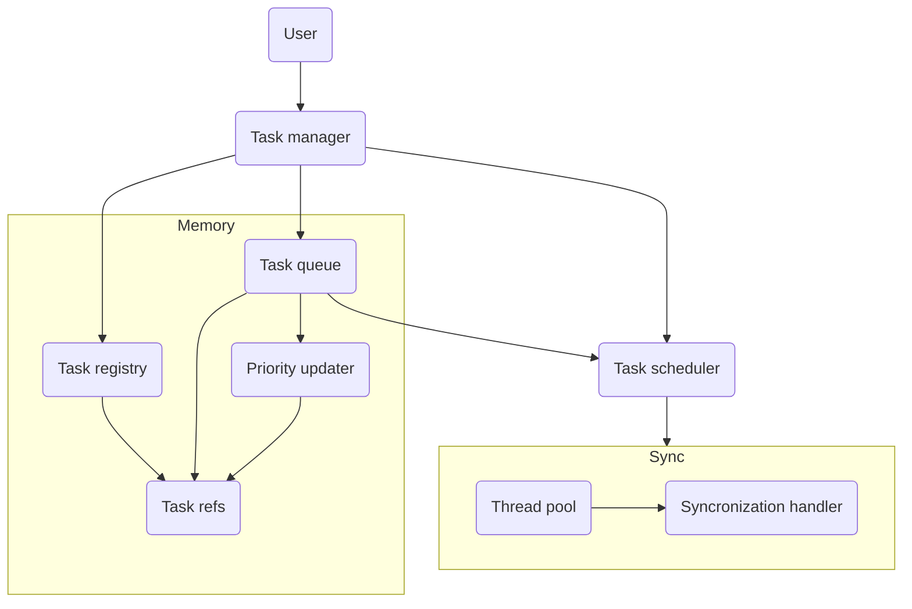

# Project Technical Overview

---

This file has as goal to fully explain the project in details. This is useful to easily keep track of the project progress and to help potential contributors to know what they are doing.

## Objectives

The main objective of this task manager is to handle complex task hierarchy in multi-threading while still being very fast.

## Hierarchy

