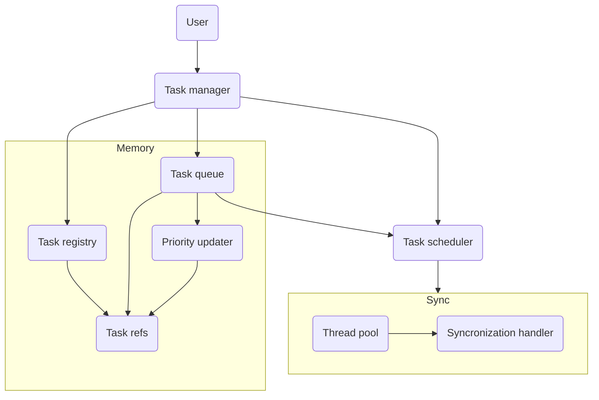
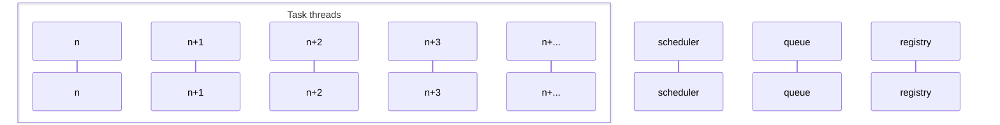
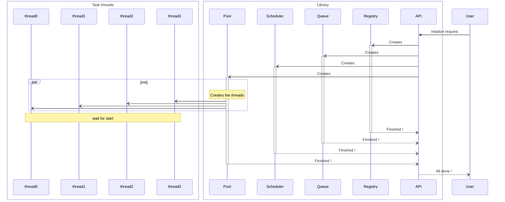

# Project Technical Overview

---

This file has as goal to fully explain the project in details. This is useful to easily keep track of the project progress and to help potential contributors to know what they are doing.

## Objectives

The main objective of this task manager is to handle complex task hierarchy in multi-threading while still being very fast.

## Hierarchy

Here is the main hierarchy of the api. We will learn more about each parts and submodules.

## Task Manager

So, the role of the task manager is to create a link between the user and the actual task manager. It is not a critical part but act more like a bridge. It is supposed to be easily understood, and easy to work with. This part HAS to be documented.

## Task Registry

The task registry is used to store task data and link them to a unique ID. One of it’s goal is to efficiently handle memory usage. Here is how it works :

The registry stores tasks data in an array, using this, all the tasks can be accessed efficiently with a O(1) complexity using the the array index as the task ID. To keep track of the unused they are stored in a queue. When creating a new task, the first free ID in the queue is used, and thus removed from the free task ID. If there is no free ids in the queue, there could be two cases : easer the registry reallocate the task data array, or it simply throws an exception.

This way of handling IDs have multiple benefits such as it’s fast yet simple implementation, it’s versatility and robustness. It is maybe not the best way of handling, but it is efficient enough for this scenario and would not cause issues with the api global speed. 

## Task Queue

The task queue goal is to handle the currently requested task, it has to respect the task priorities while still being easily updated. Note that the task queue does not have a copy of each tasks in the registry, it otherwise uses Task Refs, classes that link to the base task while maintaining runtime changing variables such as the priority.

Whats make the task queue a bit more complex that a simple priority queue is it’s dynamic aspect. The requested tasks priority is supposedly increasing over time. For example, of Task A and Task B with both a priority of 1, knowing that A has be request before B, it should be executed before and therefor have a larger priority. This dynamic priority update is what makes the queue more complex to handle.

The most naive way to handle that is to fully sort each time we increase a priority. But this can cause major performance downfall, even if this depends of requested task count and update rate, we can still find a better solution.

To solve this issue we can tackle this part by part. First of all, let’s just not sort the whole queue but only the updated tasks. Lucky for us, the sorted characteristic of the queue can help us, we can, instead of a linear search, we can use a binary search for the best position. To make the position updating easier, we can use a list to store the data and note having to move a whole bunch of the queue array, but this will completely break the binary search system. This is why we can use a cleverly designed array to store a  binary tree while not having to swap much data.

In this data layout, the task with the highest priority will be placed at the begin of the array.

Here is a simple priority array, note that here it’s just an array of integers.

|  8   |  5   |  5   |  4   |  2   |  1   |
| :--: | :--: | :--: | :--: | :--: | :--: |

So, as wanted, the first element of the array is the highest. Now, what happens if we update the last element priority to 7 ?

First of all, nothing much except the change in the value.

|  8   |  5   |  5   |  4   |  2   |  7   |
| :--: | :--: | :--: | :--: | :--: | :--: |

since it’s index is 5, it will check check the $\frac {id - 1} 2$ index, in this case this gives $\frac {5 - 1} 2$ which gives index 2. And the it compares the attributes values, here it gives $7 > 5$ and thus, it swaps them.

Note that we use $\frac {id-1} 2$ instead of simply $\frac {id} 2$ because it is a zero starting array, and the $-1$ compensate this.

|  8   |  5   |  7   |  4   |  2   |  5   |
| :--: | :--: | :--: | :--: | :--: | :--: |

 it will do it again, in this case compare itself with the index 1, and again $7>5$. Which gives us another swap.

|  8   |  7   |  5   |  4   |  2   |  5   |
| :--: | :--: | :--: | :--: | :--: | :--: |

This works great and it is also what is done when when pushing a value, it is pushed at the end of the queue.
But as you can see, there is a little issue, the queue is not completely sorted, the 5 that we swapped at the beginning is now at the back of the queue even tho it is not the smallest element. What the queue ensure us, is that the first element will always be the largest of the queue and not that it is entirely sorted. Even tho this look like an issue right now. When popping the first element, what’s behind get sorted. Here is how it is done :

When popping the first element, it copies the last element value and then remove the last element, which gives us : 

|  5   |  7   |  5   |  4   |  2   |
| :--: | :--: | :--: | :--: | :--: |

it will then check the value of it’s neighbors. In this case, since it is the first element, it does not have a left neighbor but has a right one : $5<7$, and so it swaps them.

|  7   |  5   |  5   |  4   |  2   |
| :--: | :--: | :--: | :--: | :--: |

It checks again, but in this case, it’s left neighbor is greater and right one is equal, and so, it does nothing. However, if it is still largest that it’s right neighbor, it will get swap with it, and then repeat the whole process.

This gives us here a sorted queue, but as seen before, it is not said that the queue will be fully sorted every time, but what’s count is that the first element is the greatest.

## Priority updater

As seen in the task queue explanation. The task priority grows over time to unsure that tasks are executed in the least amount of time after their execution request. It is the job of the priority updater. The update rate of tasks can be a difficult part of this project. Here are potential non concurrent possibilities :

- Importance and criticality
  Tasks that are flagged as important and or critical should be increased more often to ensure that they are executed at time.
- Dependency
  Tasks whose dependencies has been triggered should increase their priority to avoid delay between both tasks.
  This is the same with concurrent tasks.
- Threshold
  Tasks that have not been updated in a long time (relative to the program execution) should have their priority increased.
- Success / failure reward
  Tasks that constantly success and end on time should see their priority increase and tasks that do not respect their time limit and or fails should see their priority decreased to avoid bottleneck.

These are potential systems, of course, the user should be able to set which tasks are viable for each of these system. But this do not really tells us when to update their priority, as seen before, updating a priority is not that expensive as itself, but done multiple time, it can get more and more expensive. This is why i thought of updating their priority every time a new task get requested. This way, if nothing is requested anymore, it will just finish the existing tasks and be done.

## Task scheduler

This part can also be quite hard to think of. There can be one system that can do the trick. A simple description of this will be, a system that will just sleep until the next task scheduled execution, once it is done, it will query the next task to execute, look at the time until this and just sleep until this moment. This would require a whole thread just for itself, but i will however minimize CPU usage since it would only sleep most of it time.

This class should store a list of all cyclically scheduled tasks, there time between each trigger and the time since the last execution. This system will iterate though all of them, performing simple subtractions and know what is the next task to trigger. Thanks to that, is knows when to trigger it next time and will just sleep until this time. Once it has finished sleeping, it will trigger it and repeat the whole process. If there is not a single task to wait for, it will just either wait for one task to be scheduled or the system to be killed.

## Thread pool

The thread pool is, as it’s name suggest a list of threads. It’s goal is to handle the thread in use count. it will tests multiple thread combination to know which one is the most effective. The user should be able to set, the minimal and the maximal amount of thread to have. Each threads run a function that will try to execute the task with the highest priority. But before running the task, it will check things such as the concurrencies / dependencies. If everything is correct, it will run it and store the time of this execution. This time since last execution value is used by dependency to see how many time passed by and to check if the dependency is still valid. Once the execution is done, it will store in another registry the time of execution and if the task got successfully executed. As seen before, these values are useful to perform efficiency tests.
But, if the dependencies are not met during the check, it will try to run the next task in the queue. Even tho it is not promised that it is the task with the second greatest priority, it is still one of the largest and has still to be done. An again, if the checks still fails, it will try the 3rd one, etc…

## Synchronization handler

To unsure that everything works well, the synchronization handler is critical, it is simply said just a collection of mutexes and barriers, but despite this simple task, it is very important and nice to have in a well organized class.

## Synchronization

Here is the base architecture

### Initialization

